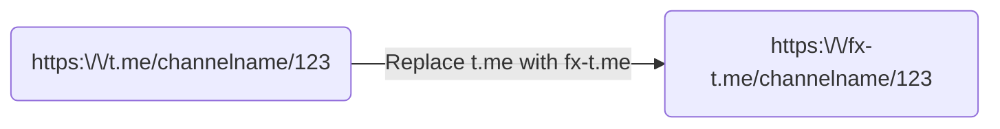
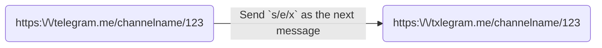
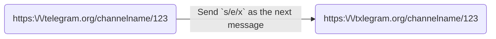

# FxTelegram

**Fix Telegram link embeds for Discord, Slack, iMessage, and anywhere OpenGraph is used.**

Replace `t.me` with `fx-t.me` in any Telegram link and get a rich embed instead of a bare URL preview.

## Discord tips

**Advanced — Discord's find-and-replace shorthand:**

If you post a `telegram.me`/`telegram.org` link, send `s/e/x` as your next message and Discord will replace the first match inline:

---

## What you get

- **Images** — full-resolution preview with correct dimensions
- **Multi-image albums** — composited into a smart mosaic layout (2–7 images) that adapts to portrait and landscape aspect ratios; Discord shows a native gallery with all images individually
- **Videos** — inline playback directly in Discord (no clicking through)
- **Text posts** — full post text with channel name and author
- **Files** — filename, size, and type for public posts
- **Reactions and views** — displayed inline with the embed (e.g. ❤️ 1.2K  💬 34  👁️ 8.5K)
- **Channel avatars** — channel profile picture shown alongside the embed
- **ActivityPub / Mastodon compatibility** — Discord uses the Mastodon oEmbed protocol to detect rich link previews; FxTelegram implements this protocol so Discord renders the full embed

---

## How it works

FxTelegram acts as a lightweight proxy between the platform (Discord, Slack, etc.) and Telegram:

1. Platform bot hits `fx-t.me/channelname/123`
2. Worker fetches content from Telegram, extracts media and metadata
3. Returns enriched OpenGraph/ActivityPub tags — image(s), video, title, description, stats
4. Platform renders a rich embed; regular users are sent straight to `t.me`

Discord's Mastodon oEmbed detection is fully supported — FxTelegram implements the ActivityPub instance endpoints so Discord uses its richer Mastodon embed path instead of the basic OG fallback.

Built on Cloudflare Workers for fast, globally distributed responses with KV-backed caching.

---

### Domains

| Domain                                   | Notes                                  |
| ---------------------------------------- | -------------------------------------- |
| [fxtelegram.org](https://fxtelegram.org) | Primary                                |
| [fx-t.me](https://fx-t.me)               | Short form — swap `t.me` for `fx-t.me` |
| [fxtelegram.me](https://fxtelegram.me)   | Alternate                              |
| [fixupt.me](https://fixupt.me)           | Alternate                              |
| [txlegram.me](https://txlegram.me)       | Discord `s/telegram/txlegram`          |
| [txlegram.org](https://txlegram.org)     | Discord `s/telegram/txlegram`          |

### URL modifiers

Append modifiers to the path to change embed behavior:

| Modifier              | Example             | Effect                                              |
| --------------------- | ------------------- | --------------------------------------------------- |
| `/p2` — photo index   | `fx-t.me/ch/123/p2` | Show only photo 2 from an album                     |
| `/m` — mosaic         | `fx-t.me/ch/123/m`  | Force mosaic even when Discord would show a gallery |
| `/t` — text only      | `fx-t.me/ch/123/t`  | Strip all media, show text only                     |
| `/[lang]` — translate | `fx-t.me/ch/123/es` | Translate post text (ISO 639-1 code)                |

### Special subdomains

| Subdomain     | Example                     | Effect                             |
| ------------- | --------------------------- | ---------------------------------- |
| `m.` — mosaic | `m.fxtelegram.org/ch/123`   | Force mosaic layout                |
| `d.` — direct | `d.fxtelegram.org/ch/123`   | Redirect directly to the media URL |
| `t.` — text   | `t.fxtelegram.org/ch/123`   | Text-only embed                    |
| `api.` — JSON | `api.fxtelegram.org/ch/123` | Return raw JSON post data          |

---

### Supported link types

| Link                   | Support                                 |
| ---------------------- | --------------------------------------- |
| `t.me/channelname/123` | Public channel post                     |
| `t.me/channelname`     | Channel profile (redirects to Telegram) |
| `t.me/+inviteHash`     | Invite links (redirects to Telegram)    |

---

## Contributing

Issues and PRs welcome. See the project board for planned work.

---

## License

[MIT](LICENSE)
